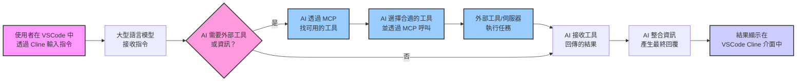

# 用 Cline 在 VSCode or Claude 玩轉 Model Context Protocol (MCP)  🚀

* [Youtube Tutorial - 用 Cline 在 VSCode 玩轉 Model Context Protocol (MCP)](https://youtu.be/t_n9xWmhEZw)

* [Youtube Tutorial - 告別手動撈資料 Claude AI MCP 自動查詢 Odoo PostgreSQL](https://youtu.be/EOZ91jD9aL8)

* [Youtube Tutorial - 複雜爬蟲掰掰！Playwright MCP + AI 輕鬆實現 PTT 圖片自由！](https://youtu.be/3u7m4XPT8Zs)

* [Youtube Tutorial - 當 Claude 3.7 擁有了手腳：實測 Augment Code 如何 MCP 操作 odoo 資料庫、瀏覽器](https://youtu.be/dmiQ0zNe-JE)

## MCP 到底是什麼？ 🤔

MCP 的全名是 Model Context Protocol。簡單說，它就像是 AI 界的 USB Type-C 🔌 ✨

想想看以前，手機、電腦、平板，每種都要不同的充電線和插頭，超麻煩對吧 😩

USB Type-C 出來後，一條線搞定很多事.

MCP 也是類似的概念，它想給 AI 一個通用的溝通方式，讓 AI 可以很方便地去發現、搞懂、然後使用外部的工具或服務。

這樣有啥好處？ 💡

開發者就不用再為了接不同的 AI 或工具，一直去研究那些 API 參數。

而且，AI 自己也能更聰明，看情況決定要用哪個工具來幫忙.

## MCP 跟 Function Calling 有啥不同？

你可能聽過 Function Calling( N8N 的 AI Agent 比較類似這個)，那也能讓 AI 去叫外面的功能。

但 MCP 又更靈活一點！

Function Calling 通常是你得先告訴 AI 有哪些功能可以用，像個菜單一樣。

但 MCP 更像是讓 AI 自己主動去看看周圍 (Context) 有哪些工具可以用，然後自己決定要怎麼用。

## 流程圖

下面這張圖，大約就是你在 VSCode 用 Cline 跟 AI 聊天時，背後 MCP 在忙什麼：



## Cline

透過 [Cline](https://github.com/cline/cline), 其實就是一個 VSCode 的擴充功能

目前已經很非常多 [awesome-mcp-servers](https://github.com/punkpeye/awesome-mcp-servers)

很多 MCP 的工具或伺服器都是用 Python 或 Node.js 寫的, 所以建議大家可以先安裝.

MCP Server 就是在你的本機運行一些程式,


Cline 取得「大語言模型決定」後，用這個決定作為依據，再去呼叫 MCP Server.

整理一下,

MCP Host 是 VSCode

MCP Client 是 Cline

MCP Server 是 本機運行的程式

如果你想加入, sse 的遠端 server, 直接將 URL 貼到 Remote Servers 即可.


### 安裝 Node.js

[下載 Node.js](https://nodejs.org/zh-tw/download)

```cmd
# 下載並安裝 nvm:
curl -o- https://raw.githubusercontent.com/nvm-sh/nvm/v0.40.1/install.sh | bash

# 下載並安裝 Node.js:
nvm install 22

# 核對 Node.js 版本:
node -v # 應會印出 "v22.14.0"。
nvm current # 應會印出 "v22.14.0"。

# 核對 npm 版本：
npm -v # 應會印出 "10.9.2"。
```

## Claude

這個社群板不維護了

~~Linux 目前只有社群維護的版本 [claude-desktop-debian](https://github.com/aaddrick/claude-desktop-debian)~~

~~如果你想要用它連結你的遠端 MCP Server,~~

~~請到 `~/.config/Claude/claude_desktop_config.json` 設定~~

```json
{
  "mcpServers": {
    "n8n mcp": {
      "command": "npx",
      "args": [
        "-y",
        "supergateway",
        "--sse",
        "https://xxxxxxx/mcp/xxxxxxxxx/sse"
      ]
    }
  }
}

```

使用的概念是 [supergateway - sse--stdio](https://github.com/supercorp-ai/supergateway?tab=readme-ov-file#sse--stdio)

接著重新啟動 Claude, 如果都設定正確


## MCP Server

* [PostgreSQL](https://github.com/crystaldba/postgres-mcp) - Postgres MCP Pro

* [Filesystem MCP Server](https://github.com/modelcontextprotocol/servers/tree/main/src/filesystem) - 可以讀寫本地文件

* [Sequential Thinking MCP Server](https://github.com/modelcontextprotocol/servers/tree/main/src/sequentialthinking) - 拆解問題, 分析, 推理, 思考.

* [Basic Memory](https://github.com/basicmachines-co/basic-memory) - 長期記憶 (紀錄對話歷史, 會去讀取你之前問過得內容).

* [Firecrawl MCP Server](https://github.com/mendableai/firecrawl-mcp-server) - 透過 Firecrawl 抓取網路上的資訊.

* [Tavily MCP Server](https://github.com/tavily-ai/tavily-mcp) - 透過 Tavily api 連網搜尋.

* [Playwright MCP](https://github.com/microsoft/playwright-mcp) - 呼叫瀏覽器 [複雜爬蟲掰掰！Playwright MCP + AI 輕鬆實現 PTT 圖片自由！](playwright-mcp-tutorial)

* [Context7 MCP](https://github.com/upstash/context7) - 讓 AI 幫你自動閱讀文檔.

### Context7

* [Youtube Tutorial - 告別 AI 瞎猜！Context7 MCP + clinerules 精準生成 Odoo 18 Addon](https://youtu.be/lYtQpV3icDY)

告別 AI 瞎猜！ Context7 MCP 搭配 `.clinerules` 優化 Prompt，精準生成 Odoo 18 Addon 實戰

官網使用可以到 [context7](https://context7.com)

Context7 MCP：為你的 AI Prompt 提供最新的程式碼文件

【問題：沒有 Context7 時 ❌】

大型語言模型 (LLM) 在回答程式碼相關問題時，常常依賴過時或通用的訓練資料，導致：

❌ 程式碼範例過時，基於一年前的舊資料。
❌ 產生出根本不存在的幻想 API。
❌ 針對舊的軟體包版本，給出通用或不適用的答案。

【解決方案：使用 Context7 時 ✅】

Context7 MCP 能直接從原始來源抓取最新、針對特定版本的文件和程式碼範例，並將這些最新資訊直接放入你提供給 AI 的 Prompt (提示語) 的上下文中。

VS Code MCP 設定 [Context7 MCP](https://github.com/upstash/context7)

```json
{
  "servers": {
    "Context7": {
      "type": "stdio",
      "command": "npx",
      "args": ["-y", "@upstash/context7-mcp@latest"]
    }
  }
}
```

使用 Cline + Odoo 18 + `gemini-2.0-flash-001` 來實戰一下,

這邊除了用 Context7 之外, 還會使用 Filesystem MCP Server.

直接把我們的需求全部給 Cline 不切實際, 效果也不好, 透過 `.clinerules` 來改善這個問題

設定的位置在這邊


範例可參考 [.clinerules](.clinerules) 資料夾底下

[.clinerules/00-doc.md](.clinerules/00-doc.md) - 請它用 Context7 先閱讀文件, 避免幻覺.

[.clinerules/01-logic.md](.clinerules/01-logic.md) - 定義他的邏輯.

接著直接給 Cline 下 Prompt

```text
先閱讀文件 再開發 addons
```

如果在執行中, 你想要讓 Cline 自動一直執行下去, 不要每次都一直和你要求允許,

點擊打勾這個圖示, 右邊的 autoApprove 就會填入對應的事件 type, 之後遇到相同的就會跳過去了


## Augment Code

介紹 [augmentcode](https://www.augmentcode.com/)

14天試用, 300則免費用 (絕對夠你用, 我自己測試使用起來很省)

沒有模型可以選(也不能切換), 就一種而已.

使用模型 Claude 3.7 Sonnet (如果尖峰可能會降成 3.5)

## Donation

文章都是我自己研究內化後原創，如果有幫助到您，也想鼓勵我的話，歡迎請我喝一杯咖啡  :laughing:

綠界科技ECPAY ( 不需註冊會員 )


[贊助者付款](http://bit.ly/2F7Jrha)

歐付寶 ( 需註冊會員 )


[贊助者付款](https://payment.opay.tw/Broadcaster/Donate/9E47FDEF85ABE383A0F5FC6A218606F8)

## 贊助名單

[贊助名單](https://github.com/twtrubiks/Thank-you-for-donate)

## License

MIT license
