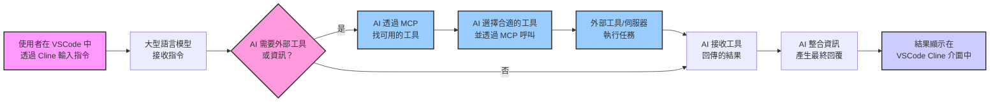

# 用 Cline 在 VSCode 玩轉 Model Context Protocol (MCP)  🚀

* [Youtube Tutorial - 用 Cline 在 VSCode 玩轉 Model Context Protocol (MCP)](https://youtu.be/t_n9xWmhEZw)

## MCP 到底是什麼？ 🤔

MCP 的全名是 Model Context Protocol。簡單說，它就像是 AI 界的 USB Type-C 🔌 ✨

想想看以前，手機、電腦、平板，每種都要不同的充電線和插頭，超麻煩對吧 😩

USB Type-C 出來後，一條線搞定很多事.

MCP 也是類似的概念，它想給 AI 一個通用的溝通方式，讓 AI 可以很方便地去發現、搞懂、然後使用外部的工具或服務。

這樣有啥好處？ 💡

開發者就不用再為了接不同的 AI 或工具，一直去研究那些 API 參數。

而且，AI 自己也能更聰明，看情況決定要用哪個工具來幫忙.

## MCP 跟 Function Calling 有啥不同？

你可能聽過 Function Calling( N8N 的 AI Agent 比較類似這個)，那也能讓 AI 去叫外面的功能。

但 MCP 又更靈活一點！

Function Calling 通常是你得先告訴 AI 有哪些功能可以用，像個菜單一樣。

但 MCP 更像是讓 AI 自己主動去看看周圍 (Context) 有哪些工具可以用，然後自己決定要怎麼用。

## 流程圖

下面這張圖，大約就是你在 VSCode 用 Cline 跟 AI 聊天時，背後 MCP 在忙什麼：



## Cline

透過 [Cline](https://github.com/cline/cline), 其實就是一個 VSCode 的擴充功能

目前已經很非常多 [awesome-mcp-servers](https://github.com/punkpeye/awesome-mcp-servers)

很多 MCP 的工具或伺服器都是用 Python 或 Node.js 寫的, 所以建議大家可以先安裝.

MCP Server 就是在你的本機運行一些程式,


Cline 取得「大語言模型決定」後，用這個決定作為依據，再去呼叫 MCP Server.

整理一下,

MCP Host 是 VSCode

MCP Client 是 Cline

MCP Server 是 本機運行的程式

### 安裝 Node.js

[下載 Node.js](https://nodejs.org/zh-tw/download)

```cmd
# 下載並安裝 nvm:
curl -o- https://raw.githubusercontent.com/nvm-sh/nvm/v0.40.1/install.sh | bash

# 下載並安裝 Node.js:
nvm install 22

# 核對 Node.js 版本:
node -v # 應會印出 "v22.14.0"。
nvm current # 應會印出 "v22.14.0"。

# 核對 npm 版本：
npm -v # 應會印出 "10.9.2"。
```

## Donation

文章都是我自己研究內化後原創，如果有幫助到您，也想鼓勵我的話，歡迎請我喝一杯咖啡  :laughing:

綠界科技ECPAY ( 不需註冊會員 )


[贊助者付款](http://bit.ly/2F7Jrha)

歐付寶 ( 需註冊會員 )


[贊助者付款](https://payment.opay.tw/Broadcaster/Donate/9E47FDEF85ABE383A0F5FC6A218606F8)

## 贊助名單

[贊助名單](https://github.com/twtrubiks/Thank-you-for-donate)

## License

MIT license