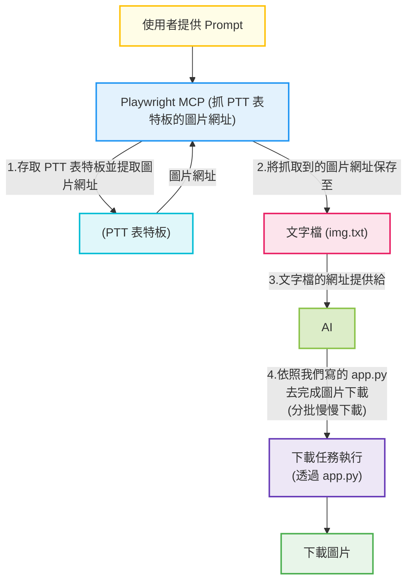

# Playwright MCP

* [Youtube Tutorial - 複雜爬蟲掰掰！Playwright MCP + AI 輕鬆實現 PTT 圖片自由！(等待新增)](xxx)

playwright 在 [深入 browser-use 的多模態自動化革命](https://github.com/twtrubiks/browser-use-tutorial) 這邊和大家提過了, 今天單獨來使用它.

[playwright-mcp](https://github.com/microsoft/playwright-mcp)

## Running on Linux - Standalone MCP server

安裝 playwright, 這邊使用 npx,

```cmd
npx @playwright/mcp@latest --port 8931
```

然後設定 `SSE` endpoint, 到你的 Vscode

```json
{
  "mcpServers": {
    "playwright": {
      "url": "http://localhost:8931/sse"
    }
  }
}
```

## 流程

以前抓圖片非常辛苦, 尤其是要解析網頁 tag, 可參考我以前寫的 [PTT圖片下載器 (Python) For Windows and Linux](https://github.com/twtrubiks/PTT_Beauty_Spider/tree/master).

現在我們把抓取圖片網址並解析這個麻煩的部份給 AI 處理, 我們只負責下載圖片, 流程如下,

透過 Prompt 讓 Playwright MCP 抓 PTT 表特板的圖片網址, 將抓取到的圖片網址保存到文字檔, 接著讓 AI 將文字檔的網址透過我們寫的 `app.py` 去完成圖片的下載(分批慢慢下載).



## Prompt

請參考 [00-doc.md](.clinerules/00-doc.md)

## 注意事項

如果你要用最新板的 cline, 會有讀不到 terminal 輸出的問題, 請參考 [https://github.com/cline/cline/issues/3445#issuecomment-2901994208](https://github.com/cline/cline/issues/3445#issuecomment-2901994208)

建議直接把 cline 預設的 terminal 改成 zsh.

如果你要持續在背景執行任務, 請使用 `nohup`

他的全名是 "no hang up"，意思是「不要中斷」.

主要功能是讓您執行的指令或程式在您登出系統或關閉終端機後，仍然可以繼續在背景執行，

不會因為 SIGHUP (hangup) 訊號而被終止.

`nohup python app.py "https://xxxxx.jpeg" &`

或是把它寫入檔案中(因為我們要用輸出判斷成功或失敗, 這邊是使用這個方法)

`python app.py "https://xxxxx.jpeg" > my_output.log 2>&1 &`

## 結論

基本上, 你要用在 Cursor, Windsurf, Claude 這類都沒問題.

## Donation

文章都是我自己研究內化後原創，如果有幫助到您，也想鼓勵我的話，歡迎請我喝一杯咖啡  :laughing:

綠界科技ECPAY ( 不需註冊會員 )


[贊助者付款](http://bit.ly/2F7Jrha)

歐付寶 ( 需註冊會員 )


[贊助者付款](https://payment.opay.tw/Broadcaster/Donate/9E47FDEF85ABE383A0F5FC6A218606F8)

## 贊助名單

[贊助名單](https://github.com/twtrubiks/Thank-you-for-donate)

## License

MIT license
